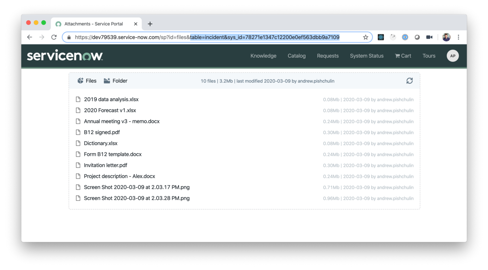
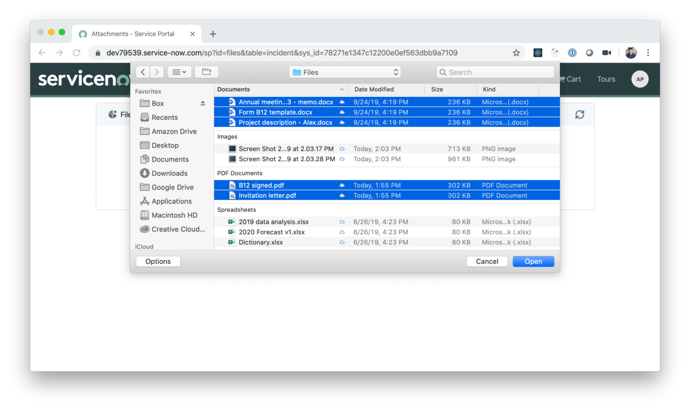
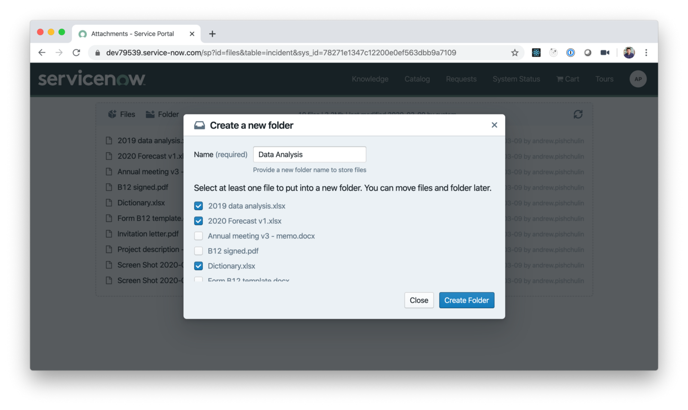
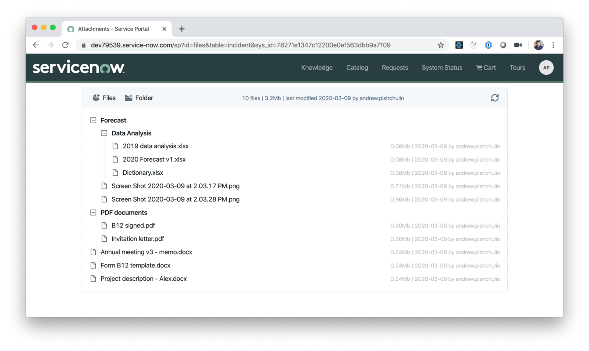
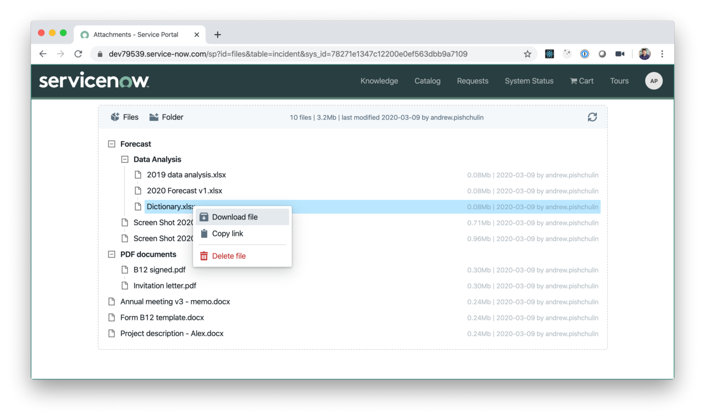
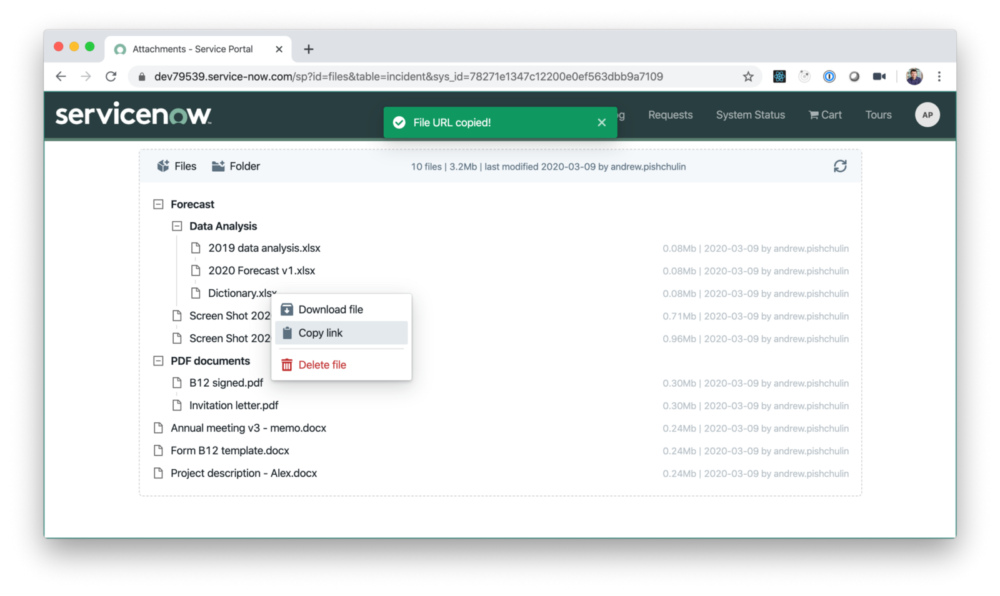
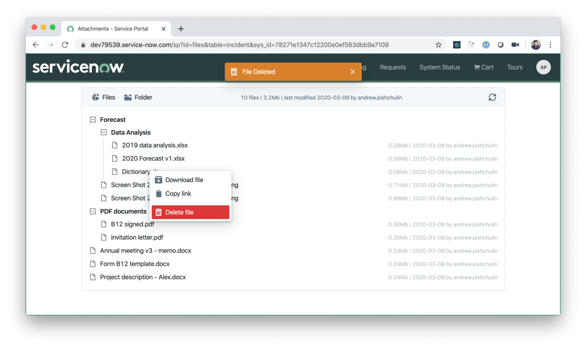
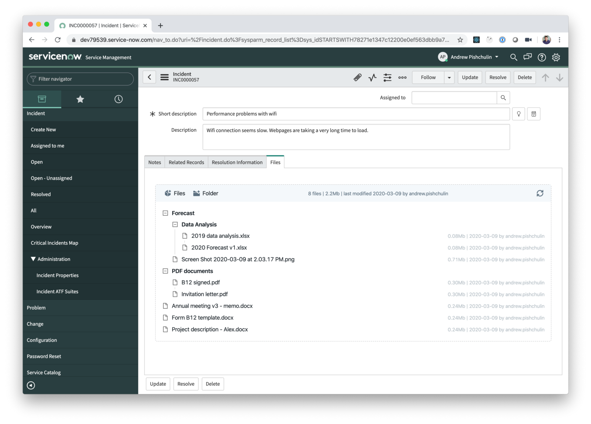

# Service Portal attachments widget

To install the widget you need to do the following:

1. Download an XML update set - **File Manager Widget.xml**. You can get the file from this repo or [download](https://s3.amazonaws.com/dev-labs.io/file-manager/File-Manager-Widget.xml) it instantly.
2. Import it into your ServiceNow instance: navigate to **System Update Sets > Retrieved Update Sets**, select **Import Update Set from XML**, and upload the XML file.
3. Preview and commit the imported update set.

Once the update set installed, a new Service Portal widget File Manager will be become available and you can use it on any Service Portal page and in custom applications.

Service Portal widget name is "File Manager" and a widget ID is `elin-file-manager-v1` 

## How to use the widget

The widget displays the list of attachments on the current record identified by table and sys_id parameters from the page URL. So make sure you specify those parameters when loading the page:

The widget provides the following functionality:
1. **Upload files** -one or multiple files can be uploaded with a single button click:

2. **Create folders** - you create folders and move files instantly:

3. **Move files & folders** - you can create a folder structure/hierarchy by simple drag'n'drop:

4. **Download a file** - right-click context menu allows to download a file:

5. **Copy direct link to the file** - you can share a direct link to the file with other users so they can download the file (users should have at least `read` access to the file to be able to download)

6. **Delete the file** - individual files can be deleted using the context menu:

Service Portal widget can also be used in ServiceNow native UI, all you need to do is just to create a UI Macro/formatter which loads a service portal page with that widget:

## Advanced version and customization

Advanced version of the widget includes the following functionality:
1. Batch actions 
2. Ability to rename files/folders
3. Email client to send files via email
4. Ability to move files and folders to a different record

For more details about the advanced version or if you need a custom widget with a specific functionality - please contact info@elinsoftware.com.